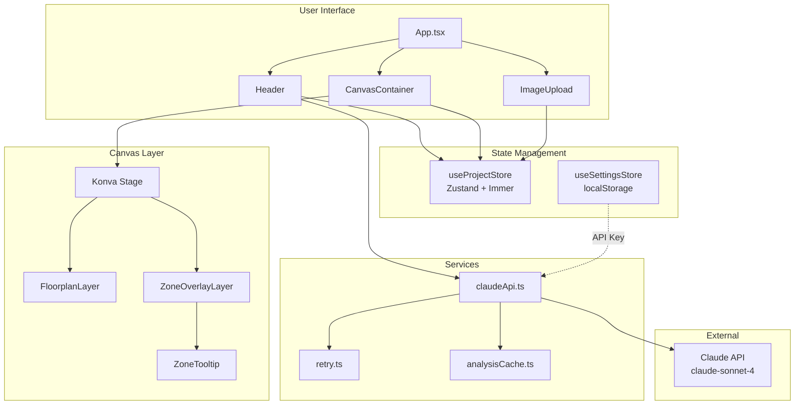
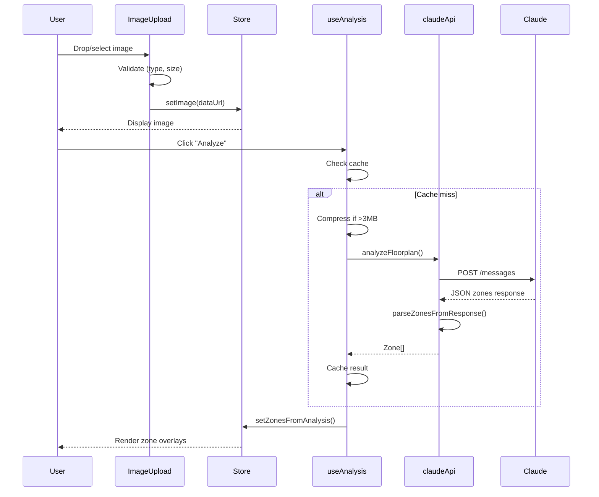
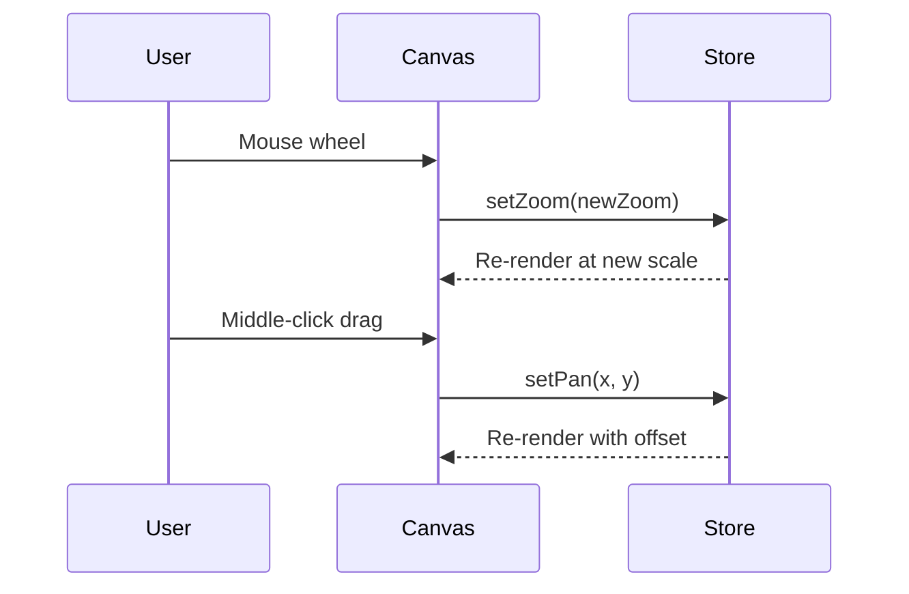

# Codebase Map

> Auto-generated by Cartographer. Last mapped: 2026-01-19

## System Overview



## Technology Stack

| Layer | Technology |
|-------|------------|
| Frontend | React 19.2.3, TypeScript (strict) |
| Canvas | Konva.js, react-konva |
| State | Zustand 5 + Immer |
| Styling | Tailwind CSS 4.1 |
| Build | Vite 7.3.1 |
| Testing | Vitest 4.0, Testing Library |
| AI | Claude API (claude-sonnet-4-20250514) |

## Directory Structure

```
floorplan-/
├── docs/                          # Documentation
│   ├── spec.md                    # Full specification (800+ lines)
│   ├── sprint-plan.md             # 9-sprint development plan
│   ├── store-schema.md            # Zustand state documentation
│   └── IMAGE_COMPRESSION_TROUBLESHOOTING.md
│
├── src/
│   ├── components/
│   │   ├── analysis/              # AI analysis controls
│   │   │   └── AnalyzeButton.tsx  # Triggers Claude analysis
│   │   ├── canvas/                # Konva canvas rendering
│   │   │   ├── CanvasContainer.tsx    # Stage wrapper, pan/zoom
│   │   │   ├── FloorplanLayer.tsx     # Base image display
│   │   │   ├── ZoneOverlayLayer.tsx   # Zone polygons
│   │   │   ├── ZoneTooltip.tsx        # Hover info display
│   │   │   └── ImageInfo.tsx          # Dimensions overlay
│   │   ├── layout/                # App structure
│   │   │   ├── Header.tsx         # Top bar with actions
│   │   │   ├── MainLayout.tsx     # Flex container
│   │   │   └── Toolbar.tsx        # Bottom toolbar
│   │   ├── settings/              # Configuration UI
│   │   │   └── ApiKeyModal.tsx    # API key input modal
│   │   ├── toolbar/               # Toolbar components
│   │   │   └── ZoomControls.tsx   # Zoom slider/buttons
│   │   └── upload/                # Image upload
│   │       ├── ImageUpload.tsx    # Drag-drop handler
│   │       └── EmptyState.tsx     # Upload prompt UI
│   │
│   ├── hooks/
│   │   ├── useAnalysis.ts         # Claude API orchestration
│   │   └── useKeyboardShortcuts.ts # Global keyboard events
│   │
│   ├── services/
│   │   ├── claudeApi.ts           # Claude API client
│   │   ├── retry.ts               # Exponential backoff
│   │   └── analysisCache.ts       # Session storage cache
│   │
│   ├── store/
│   │   ├── useProjectStore.ts     # Main app state (Zustand)
│   │   └── useSettingsStore.ts    # Persisted settings
│   │
│   ├── types/
│   │   ├── zone.ts                # Zone, Point, ZoneType
│   │   └── store.ts               # Store interfaces
│   │
│   ├── utils/
│   │   ├── fileValidation.ts      # Image file validation
│   │   ├── imageCompression.ts    # Canvas-based compression
│   │   └── zoneColors.ts          # Zone type → color mapping
│   │
│   ├── App.tsx                    # Root component
│   ├── main.tsx                   # ReactDOM entry
│   └── index.css                  # Global styles + Tailwind
│
├── package.json
├── tsconfig.json
├── vite.config.ts
└── vitest.config.ts
```

## Module Guide

### Types (`src/types/`)

**Purpose**: TypeScript interfaces for type safety

| File | Purpose | Key Exports |
|------|---------|-------------|
| `zone.ts` | Zone data structures | `Zone`, `Point`, `ZoneType`, `PREDEFINED_ZONE_TYPES`, `createZone()` |
| `store.ts` | Store type definitions | `ProjectStore`, viewport constants (`ZOOM_MIN`, `ZOOM_MAX`, etc.) |

**Zone Types**: `aisle`, `travel_lane`, `parking_lot`, `open_floor`, `loading_dock`, `intersection`, `restricted`, `pick_area`, `drop_area`, `staging_area`, `charging_station`, `hazard_zone`

---

### State Management (`src/store/`)

**Purpose**: Centralized app state with Zustand

| File | Purpose | Persistence |
|------|---------|-------------|
| `useProjectStore.ts` | Image, viewport, zones, selection, analysis state | Memory only |
| `useSettingsStore.ts` | API key storage | localStorage |

**State Slices**:
```typescript
{
  // Image
  dataUrl, filename, width, height, originalSize,

  // Viewport
  zoom, panX, panY, canvasWidth, canvasHeight,

  // Zones
  zones: Zone[],

  // Selection
  selectedZoneIds, hoveredZoneId,

  // Analysis
  analysisStatus: 'idle' | 'analyzing' | 'success' | 'error',
  analysisError
}
```

**Key Actions**: `setImage()`, `setZoom()`, `addZone()`, `updateVertex()`, `selectZone()`, `startAnalysis()`

---

### Hooks (`src/hooks/`)

**Purpose**: Reusable stateful logic

| File | Purpose | Exports |
|------|---------|---------|
| `useAnalysis.ts` | Orchestrates Claude API flow | `analyze()`, `cancel()`, `isAnalyzing`, `progress` |
| `useKeyboardShortcuts.ts` | Global keyboard events | Activates zoom shortcuts (+/-/0) |

---

### Services (`src/services/`)

**Purpose**: External API integration

| File | Purpose | Key Functions |
|------|---------|---------------|
| `claudeApi.ts` | Claude API client | `analyzeFloorplan()`, `parseZonesFromResponse()` |
| `retry.ts` | Exponential backoff | `withRetry()` (3 retries, 1s initial delay) |
| `analysisCache.ts` | Session storage cache | `getCachedAnalysis()`, `setCachedAnalysis()` |

**API Endpoint**: `https://api.anthropic.com/v1/messages`
**Model**: `claude-sonnet-4-20250514`

---

### Utils (`src/utils/`)

**Purpose**: Pure helper functions

| File | Purpose | Key Functions |
|------|---------|---------------|
| `fileValidation.ts` | Image upload validation | `validateImageFile()` - checks type (JPEG/PNG), size (≤50MB) |
| `imageCompression.ts` | Resize for API limits | `compressImageForApi()` - targets 3MB, max 4000px |
| `zoneColors.ts` | Zone type colors | `getZoneColor()`, `hexToRgba()`, 12 predefined colors |

**Claude API Limits**: 5MB file size, 8000px max dimension

---

### Components (`src/components/`)

#### Canvas (`canvas/`)
| Component | Purpose |
|-----------|---------|
| `CanvasContainer.tsx` | Konva Stage wrapper, handles pan/zoom |
| `FloorplanLayer.tsx` | Renders base image |
| `ZoneOverlayLayer.tsx` | Renders zone polygons with selection |
| `ZoneTooltip.tsx` | Hover tooltip with zone info |
| `ImageInfo.tsx` | Dimensions + zoom % overlay |

#### Layout (`layout/`)
| Component | Purpose |
|-----------|---------|
| `Header.tsx` | Top bar: logo, filename, analyze button, settings |
| `MainLayout.tsx` | Flex container for sidebars (future) |
| `Toolbar.tsx` | Bottom bar with ZoomControls |

#### Other
| Component | Purpose |
|-----------|---------|
| `AnalyzeButton.tsx` | Triggers/cancels Claude analysis |
| `ApiKeyModal.tsx` | API key input with validation |
| `ImageUpload.tsx` | Drag-drop/file picker handler |
| `EmptyState.tsx` | Upload prompt UI |
| `ZoomControls.tsx` | Zoom slider and buttons |

## Data Flow

### Image Upload → Analysis → Display



### Viewport Interaction



## Conventions

### Naming
- Components: PascalCase (`ZoneOverlayLayer.tsx`)
- Hooks: camelCase with `use` prefix (`useAnalysis.ts`)
- Utils: camelCase (`fileValidation.ts`)
- Types: PascalCase for interfaces, SCREAMING_SNAKE for constants

### State Updates
- All state changes through Zustand actions
- Immer enables direct mutation syntax
- Timestamps manually set via `new Date().toISOString()`

### Error Handling
- Custom `ClaudeApiError` with typed error codes
- User-friendly messages mapped from error types
- Toast notifications auto-dismiss after timeout

## Gotchas

### Image Size Limits
- UI shows "20 MB max" but validation allows 50MB
- Claude API hard limit: **5MB**, **8000px**
- Compression targets 3MB with max 4000px dimension

### API Key Sources
1. Settings store (localStorage) - checked first
2. Environment variable (`VITE_ANTHROPIC_API_KEY`) - fallback
3. **Security note**: API key exposed in browser for direct API calls

### Zone Replacement
- `setZonesFromAnalysis()` replaces AI zones, keeps manual zones
- Re-analysis won't restore deleted AI zones

### Viewport Transforms
- Tooltip positioning must account for both zoom AND pan
- Formula: `screenX = canvasX * zoom + panX`

### Polygon Constraints
- Minimum 3 vertices enforced in `removeVertex()`
- Silent no-op if deletion would violate constraint

## Navigation Guide

**To add a new API endpoint**:
1. Add function to `src/services/claudeApi.ts`
2. Export from `src/services/index.ts`
3. Create hook in `src/hooks/` if needed

**To add a new zone type**:
1. Add to `PREDEFINED_ZONE_TYPES` in `src/types/zone.ts`
2. Add color to `ZONE_COLORS` in `src/utils/zoneColors.ts`
3. Add CSS variable to `src/index.css`

**To add a new keyboard shortcut**:
1. Add handler in `src/hooks/useKeyboardShortcuts.ts`
2. Check for input focus to avoid conflicts

**To add a new component**:
1. Create in appropriate `src/components/` subdirectory
2. Add to `index.ts` barrel export
3. Import via `@/components/...`

**To modify state**:
1. Add action to `src/store/useProjectStore.ts`
2. Add type to `src/types/store.ts`
3. Call action from component via `useProjectStore`

## Implementation Status

| Sprint | Status | Features |
|--------|--------|----------|
| 1 | ✅ Complete | Foundation, image upload, canvas, state |
| 2 | ✅ Complete | Claude AI integration, zone detection |
| 3 | ⏳ Pending | Undo/redo system |
| 4 | ⏳ Pending | Vertex editing |
| 5 | ⏳ Pending | Polygon drawing tools |
| 6 | ⏳ Pending | Zone management panel |
| 7 | ⏳ Pending | Custom zone types |
| 8 | ⏳ Pending | Export/Import |
| 9 | ⏳ Pending | Full keyboard shortcuts |

**Current Progress**: ~30% complete (Phase 1-2 of 4 phases per spec)
